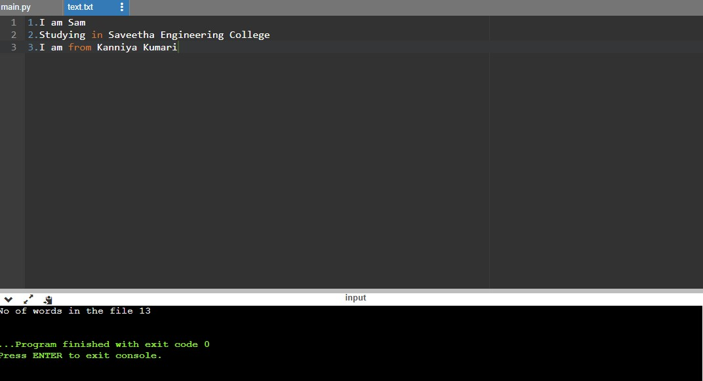

# Word-count
## AIM:
To write a python program for getting the word count from a text.
## EQUIPEMENT'S REQUIRED: 
PC
Anaconda - Python 3.7
## ALGORITHM: 
# Step 1:
Assign a variable fpr value zero
# Step 2:
Open the file required using the 'with' function
# Step 3:
Use the for loop to assign the i values i the file
# Step 4:
Use split function to split the words
# Step 5:
Finding the length of the words by using len() function
# Step 6:
Call the function and print the number of words


## PROGRAM:
```
with open ("text.txt", 'r')as fp:
    count = 0 
    for data in fp:
        l=data.split ()
        for i in l:
            count += 1 
    print ("No of words in the file", count)
```

### OUTPUT:



## RESULT:
Thus the program is written to find the word count from a text.
